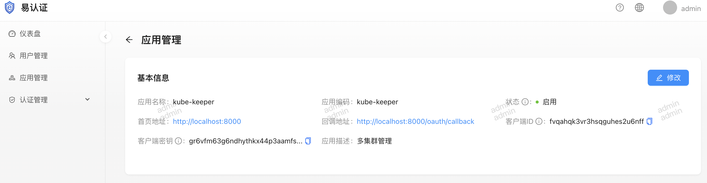

# 智易付社区版资源

- English quick access: [README.en.md](README.en.md)

## 项目介绍
### kube-keeper
以Kubernetes为内核的AI+云原生分布式一站式研发交付运维工作台，支持多租户安全隔离与公私有云统一管理。提供乐高式可视化应用编排、AI辅助运维、可视化CI/CD流水线、私有化应用商店及MCP广场，并集成分布式云IDE，实现安全高效的开发、交付与运维一体化体验，本仓库提供的是单版版本。
该项目未提供认证功能，需集成开源版本的易认证。

### 易认证（eauth）
易认证是一款企业级的认证平台，提供多种认证方式，包括人脸识别、OpenID Connect(OIDC)、Web身份认证等，支持多因素认证(MFA)， 灵活的令牌(Token)生成设置，可以实现不同应用间的一账通，能为企业提供精细化的认证管理，帮助企业快速完成认证流程，提高认证效率。

## 易认证
### 开源地址: 
1. [前端: https://github.com/efucloud/eauth](https://github.com/efucloud/eauth)
2. [后端: https://github.com/efucloud/eauth-console](https://github.com/efucloud/eauth-console)
### 部署
1. 创建命名空间efucloud
```sh
kubectl apply -f namespace.yaml
```
1. 创建mysql数据库服务，如果已经有数据库服务可以跳过该步骤
```sh
# 如果需要持久化，修改yaml文件中的注释内容，创建PersistentVolumeClaim和挂载信息。
kubectl apply -f mysql.yaml
```
1. 配置`backend.yaml`中的信息
```yaml
apiVersion: v1
kind: Secret
metadata:
  name: eauth-config
  namespace: efucloud
type: Opaque
stringData:
  config.yaml: |
    # 将会作为/.well-known/openid-configuration中的地址信息
    serverAddress: "http://eauth-demo.efucloud.com" 
    tokenPeriod: 16
    # 用户头像上传地址，可以挂载pvc持久化
    uploadPath: "/efucloud/uploads" 
    # 登录方式配置
    loginConfig:
      # 支持人脸识别
      faceRecognition: true 
      # 支持MFA，全局开关，若开启后再关闭，关闭之前添加的用户也不再使用MFA
      mfa: false
    # 数据库配置信息
    mysql:
      host: "mysql:3306"
      user: "root"
      password: "EfuCloudPSD"
      dbname: "eauth"
      charset: "utf8mb4"
      loc: "Asia/Shanghai"
      defaultStringSize: 0
      disableDatetimePrecision: false
      dontSupportRenameColumn: false
      dontSupportRenameIndex: false
      skipInitializeWithVersion: false
    # 邮件配置信息，密码找回需要
    email:
      smtpServer: "smtp.qq.com"
      smtpPort: 465
      username: "noreply@example.com"
      password: "CHANGE_ME"
    logConfig:
      production: true
      filename: ""
      maxsize: 100
      maxbackups: 7
      maxage: 30
      compress: true
      localtime: true
```
1. 部署前后端服务，若配置域名请求改`frontend.yaml`中的ingress信息，建议配置tls信息
```sh
kubectl apply -f backend.yaml
kubectl apply -f frontend.yaml
```
## kube-keeper部署
### 说明
该项目未提供认证功能，需集成开源版本的易认证

### 部署
1. 创建命名空间
```sh
kubectl create ns efucloud
```
2. 后端配置
在eauth中创建应用，获取clientid和clientsecret，其中回调地址为[kubekeeper的域名+'/oauth/callback'],例如：`https://kubekeeper.efucloud.com/oauth/callback`


```yaml
kind: Secret
apiVersion: v1
metadata:
  name: kube-keeper-config
  namespace: efucloud
type: Opaque
stringData:
  config.yaml: |
    databaseAutoMigrate: true
    logConfig:
      compress: false
      filename: ""
      level: ""
      localtime: false
      maxage: 0
      maxbackups: 0
      maxsize: 0
      production: true
    mysql:
      charset: utf8
      dbname: kubekeeper
      defaultStringSize: 0
      disableDatetimePrecision: false
      dontSupportRenameColumn: false
      dontSupportRenameIndex: false
      host: kubekeeper-mysql:3306
      loc: ""
      password: EfuCloud@Pwd
      skipInitializeWithVersion: false
      user: root
    # eauth的认证配置信息
    oidcConfig:
      clientId: fvqahqk3vr3hsqguhes2u6nff
      clientSecret: gr6vfm63g6ndhythkx44p3aamfs4k3nfumd5qz24ofpdsr5747q
      issuer: http://eauth-demo.efucloud.com
    # 对接第三方大模型api
    chatConfig:
      useTool: true
      address: https://dashscope.aliyuncs.com/compatible-mode/v1
      apiKey: sk-23486e1c9ed44d45cbb4babeaa
      model: qwen3-coder-480b-a35b-instruct
    # 管理员的邮件地址，用户登录时生效
    adminEmails:
      - admin@efucloud.cn
      - admin@efucloud.com
    # terminal使用的镜像地址
    terminalContainer: registry.cn-shenzhen.aliyuncs.com/efucloud-public/k8s-tools:v1.0.0.03132013
```
3. 部署
```sh
kubectl apply -f deployment.yaml
```
4. 访问
如果在kind，minikue上部署可以通过port-forward命令访问kube-keeper

5. 视频教程


